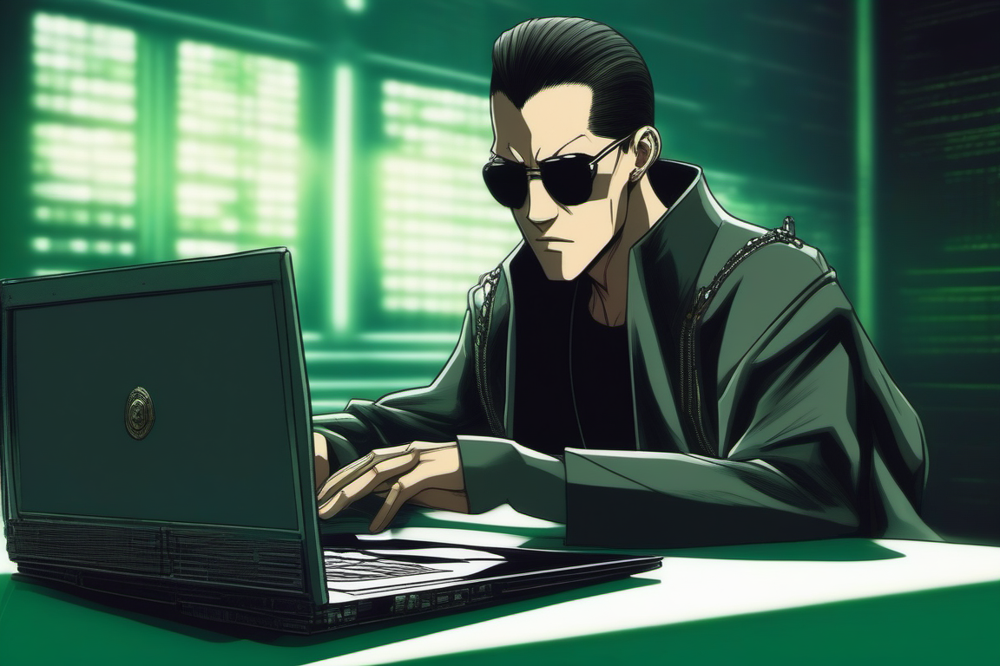

# Desafio - Criando um podcast
Projeto com o objetivo de gerar um podcast utilizando ferramentas de IA através de prompts mais trabalhados.

Utilizei uma esteira de prompts para gerar cada etapa do processo criativo.

## Título
    Código da Matrix: Se tornando o programador escolhido

## Imagem de capa

## Fontes de produção:

* Imagens geradas por: [Copilot](https://copilot.microsoft.com/)
* Edição de imagens: [Microsoft Designer](https://designer.microsoft.com/)
* Edição de áudio: [Capcut](https://www.capcut.com/)
* Conteúdo gerado por: [ChatGPT](https://chatgpt.com/)
* Voz gerada por: [Eleven Labs](https://elevenlabs.io) - Voz utilizada: Callum

## ✨ Como foi feito?

- Roteiro gerado via chatgpt
- Audio gerado pela elevenLabs
- Microsoft Designer para editar a capa
- Capcut para tratar aúdio e adicionar sons de fundo